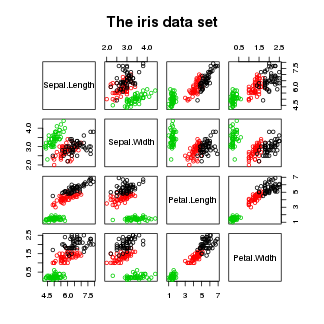
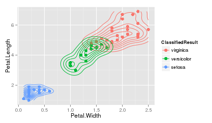
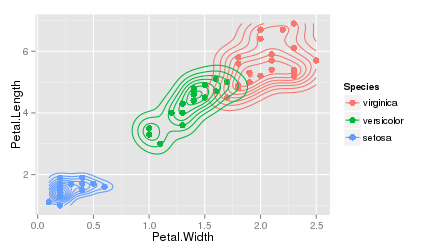

## Introduction
- clscompare is an application uses to compare KNN, CART and Random Forests classification methods.
Application URL: https://nhchau.shinyapps.io/clscompare. Data set: iris

<center>
 
</center>
- Method of comparison: Apply the above classification methods on the same training and testing data sets
then compare prediction results

--- .intro #1

## The iris data set
- The followings are the iris data set structure and the first four items:

```
## 'data.frame':	150 obs. of  5 variables:
##  $ Sepal.Length: num  5.1 4.9 4.7 4.6 5 5.4 4.6 5 4.4 4.9 ...
##  $ Sepal.Width : num  3.5 3 3.2 3.1 3.6 3.9 3.4 3.4 2.9 3.1 ...
##  $ Petal.Length: num  1.4 1.4 1.3 1.5 1.4 1.7 1.4 1.5 1.4 1.5 ...
##  $ Petal.Width : num  0.2 0.2 0.2 0.2 0.2 0.4 0.3 0.2 0.2 0.1 ...
##  $ Species     : Factor w/ 3 levels "virginica","versicolor",..: 3 3 3 3 3 3 3 3 3 3 ...
```

```
##   Sepal.Length Sepal.Width Petal.Length Petal.Width Species
## 1          5.1         3.5          1.4         0.2  setosa
## 2          4.9         3.0          1.4         0.2  setosa
## 3          4.7         3.2          1.3         0.2  setosa
## 4          4.6         3.1          1.5         0.2  setosa
```
- Predictors: Sepal.Length Sepal.Width Petal.Length Petal.Width, outcome: Species

---

## Application input parameters
- A seed number for random number generation
- Relative size of the training data set with reference to the iris data set
- Classfication method to use

--- 

## Application outputs
- Plots: Classification results (left) and Species (right) of the test data set.

  
- The confusion matrix
- The iris data set in details: List of all items in data sets. Each item
has an additional indicator specifying the item belonging to training or testing data sets
- The test data set with an additional score on each item specifying whether the item
is correctly/incorrectly classified
